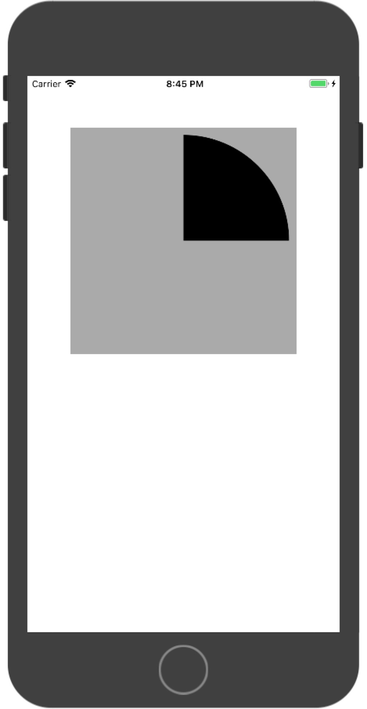

# Quartz2D

Important note: **The context start point is always (0, 0)**

## 1. Base draw Line (Base theory using context)

```swift
private func baseDraw() {
    let ctx = UIGraphicsGetCurrentContext()
    let path = UIBezierPath()

    path.move(to: CGPoint(x: 50, y: 50))
    path.addLine(to: CGPoint(x: 50, y: 150))
    path.addLine(to: CGPoint(x: 250, y: 150))
    path.close()

    UIColor.red.set()

    ctx?.setLineCap(CGLineCap.round)
    ctx?.setLineJoin(CGLineJoin.round)
    ctx?.setLineWidth(10)

    ctx!.addPath(path.cgPath)
    ctx!.strokePath()
}
```

Note:

- We can use `UIColor.red.set()` to set drawing color.
- We can use `ctx?.setLineWidth(10)` to set line width.
- We can use `ctx?.setLineCap(CGLineCap.round)` to set the Line cap.
- We can use `ctx?.setLineJoin(CGLineJoin.round)` to set the Line Join style.
- **This is just base theory, we can use UIBezierPath() to simplify this process, see below example.**

## 2. Draw rect using UIBezierPath

```swift
private func drawRect() {
        let path = UIBezierPath(rect: CGRect(x: 50, y: 50, width: 100, height: 100))

        path.move(to: CGPoint(x: 50, y: 250))
        path.addLine(to: CGPoint(x: 250, y: 250))

        path.lineWidth = 10
        path.lineCapStyle = .round
        path.lineJoinStyle = .round
        UIColor.orange.set()
        path.stroke()
    }
```

Note:

- **Line can only be stroke, fill won't work for line.**
- We can still use `UIColor.orange.set()` to set color.
- We can use `path.lineWidth`, `path.lineCapStyle` and `path.lineJoinStyle` to set path properties.

## 3. Draw rounded rect

```swift
private func drawRoundRect() {
    let path = UIBezierPath(roundedRect: CGRect(x: 50, y: 50, width: 100, height: 100) , cornerRadius: 25)
    path.fill()
}
```

## 4. Draw Arc

```swift
private func drawArc() {
    let center = CGPoint(x: self.bounds.width/2, y: self.bounds.height/2)
    let radius = self.bounds.width/2 - 10
    let path = UIBezierPath(arcCenter: center, radius: radius, startAngle: 0, endAngle: -CGFloat.pi/2, clockwise: false)
    path.addLine(to: center)
    path.close()
    path.fill()
}
```

Note:

- for `UIBezierPath(arcCenter: center, radius: radius, startAngle: 0, endAngle: -CGFloat.pi/2, clockwise: false)`, the clockwise is important here. It will decide the arc direction.
- The above example will show this:

  

## 5. setNeedsDisplay()

This is an important method. Each time if we want redraw, we should call **self.setNeedsDisplay()** function to **redraw the view**!!!

## 6. Draw Text (Draw String)

We can only use **NSString** to draw in a view

```swift
override func draw(_ rect: CGRect) {
    let str: NSString = "Lzhao"
    let attributes: [NSAttributedStringKey : Any]? = [:]
//        str.draw(at: CGPoint.zero, withAttributes: attributes)
    str.draw(in: rect, withAttributes: attributes)
}
```

The difference for `drawInPoint` and `drawInRect`: **drawInPoint won't change line and drawInRect will change Line automatically**

## 7. Draw Image

```swift
override func draw(_ rect: CGRect) {
    let image = UIImage(named: "阿狸头像")
//        image?.draw(at: CGPoint.zero)
//        image?.draw(in: rect)

    UIRectClip(CGRect(x: 0, y: 0, width: 50, height: 50))
    image?.drawAsPattern(in: rect)
}
```

The difference for `drawInPoint`, `drawInrect` and `drawAsPattern`:

- **drawInPonit** will draw using the original image size
- **drawInrect** will strech or compress the image to rect size
- **drawAsPattern** will 平铺 image

`UIRectClip` can be used to clip the image we draw. But it must be used before we draw it. (before `drawInPoint`, `drawInrect` or `drawAsPattern`).

## 8. add waterMark

```swift
override func viewDidLoad() {
    super.viewDidLoad()

    let image = UIImage(named: "阿狸头像")
    // 0.0 scale will use the default device scale
    UIGraphicsBeginImageContextWithOptions(self.imageView.bounds.size, false, 0.0)
    image?.draw(at: CGPoint.zero)

    let str: NSString = "waterMark"
    str.draw(at: CGPoint.zero, withAttributes: nil)

    let getImage = UIGraphicsGetImageFromCurrentImageContext()
    UIGraphicsEndImageContext()
    self.imageView.image = getImage
}
```

Note:

- We should use `UIGraphicsBeginImageContextWithOptions()` and `UIGraphicsEndImageContext()` to begin and end the context.
- When we add text, **we must use NSString**.
- We can only re-draw a new image, not image view.

## 9. clip an image from image

```swift
func circleImage(withBorderWidth borderWidth: CGFloat = 0, andBorderColor borderColor: UIColor = UIColor.clear) -> UIImage? {
    let ctxSize = CGSize(width: self.size.width + 2 * borderWidth, height: self.size.height + 2 * borderWidth)
    UIGraphicsBeginImageContextWithOptions(ctxSize, false, 0)

    let path = UIBezierPath(ovalIn: CGRect(x: 0, y: 0, width: ctxSize.width, height: ctxSize.height))
    borderColor.set()
    path.fill()

    let clipPath = UIBezierPath(ovalIn: CGRect(x: borderWidth, y: borderWidth, width: self.size.width, height: self.size.height))
    clipPath.addClip()
    self.draw(at: CGPoint(x: borderWidth, y: borderWidth))

    let circleImage = UIGraphicsGetImageFromCurrentImageContext()
    UIGraphicsEndImageContext()

    return circleImage
}
```

Note:

- `clipPath.addClip()` will set up a new **clip area**. For the following drawing, only the part that in this area will shows, the ourside part will be cutted.

## 10. clip image from a view

```swift
UIGraphicsBeginImageContextWithOptions(self.imageView.bounds.size, false, 0)

let clipPath = UIBezierPath(rect: (self.coverView?.frame)!)
clipPath.addClip()

self.imageView.layer.render(in: UIGraphicsGetCurrentContext()!)

let image = UIGraphicsGetImageFromCurrentImageContext()
UIGraphicsEndImageContext()

self.imageView.image = image
```

Note:

- If we want to clip an image from a view, we **must use layer** to get. `self.imageView.layer.render(in: UIGraphicsGetCurrentContext()!)`

## 11. clear small part of an image

```swift
@objc
private func pan(panGesture: UIPanGestureRecognizer) {
    let curPoint = panGesture.location(in: self.imageView)

    let clearRectWH: CGFloat = 30
    let clearRect = CGRect(x: curPoint.x - clearRectWH * 0.5, y: curPoint.y - clearRectWH * 0.5, width: clearRectWH, height: clearRectWH)

    UIGraphicsBeginImageContextWithOptions(self.imageView.bounds.size, false, 0)
    let ctx = UIGraphicsGetCurrentContext()
    self.imageView.layer.render(in: ctx!)

    ctx?.clear(clearRect)
    self.imageView.image = UIGraphicsGetImageFromCurrentImageContext()
    UIGraphicsEndImageContext()
}
```

Note:

- `ctx?.clear(clearRect)` is the function that we can use to clear a rect area.