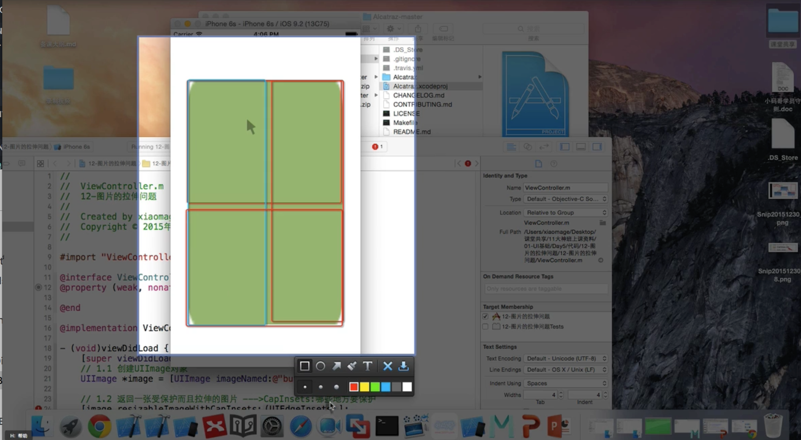

# UIImage

## 1. strech image

  we can use `image.resizableImage(withCapInsets: UIEdgeInsetsMake(image.size.height/2, image.size.width/2, image.size.height/2-1, image.size.width/2-1))` to strech an image. Look the following screen shot, the cap part means the part we don't want to strech. We protect half size from top, half size from left, half size minus 1 from bottom and half size minus 1 from right. So we only strech 1px in the middle part.

  

  We can use the following code to strech:
  ```swift
  let image = #imageLiteral(resourceName: "chat_send_nor")

  let resizeImage = image.resizableImage(withCapInsets: UIEdgeInsetsMake(image.size.height/2, image.size.width/2, image.size.height/2, image.size.width/2))

  self.imageView.image = resizeImage
  ```
  We can also use this easy method:
  ```swift
  let image = #imageLiteral(resourceName: "chat_send_nor")

  let resizeImage = image.stretchableImage(withLeftCapWidth: Int(image.size.width*0.5), topCapHeight: Int(image.size.height*0.5))

  self.imageView.image = resizeImage
  ```