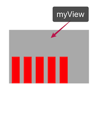

# CALayer

**Most** properties for CALayer are in the range [0, 1].

Most Color for layer properties are **CGColor**.

## 1. shadow and border

```swift
override func touchesBegan(_ touches: Set<UITouch>, with event: UIEvent?) {
    self.redView.layer.shadowColor = UIColor.blue.cgColor
    self.redView.layer.shadowOpacity = 1
    self.redView.layer.shadowOffset = CGSize(width: 10, height: 10)
    self.redView.layer.shadowRadius = 5

    self.redView.layer.cornerRadius = 5

    self.redView.layer.borderWidth = 2;
    self.redView.layer.borderColor = UIColor.green.cgColor
}
```

Note:

- `layer.shadowOpacity` default value is 0. If we don't set it, we can't see shadow.
- All **layer** related color need to **use cgcolor**.
- The border will show **in** the frame. It will occupied the content size.

## 2. UIImageView Layer

```swift
override func touchesBegan(_ touches: Set<UITouch>, with event: UIEvent?) {
    self.imageView.layer.cornerRadius = 10

    self.imageView.layer.borderColor = UIColor.green.cgColor
    self.imageView.layer.borderWidth = 2

    self.imageView.layer.masksToBounds = true
}
```

Note:

- For an UIImageView, the imageView can be set using layer, but the image is not directly add in its layer. So if we don't set `self.imageView.layer.masksToBounds` property, the **image** itself **won't be cut**. **Only UIImageView will be cut**.
- The image is not directly add to UIImageView, but add the layer contents property.

## 3. The difference for UIView and UILayer

- UIView inherit the UIResponder, which means it can deal with the user action. But UILayer did not.
- Another difference is UIView is only for iOS while UILayer can be used both in iOS and MacOS.

## 4. anchor point and postion

- Anchor Point x, y are in range [0, 1]. Anchor point is just a 定位点. The default anchor point is (x: 0.5, y: 0.5)

- Position is the actual position, but its calculated based on its anchor point. But note the default anchor point is (x: 0.5, y: 0.5)

## 5. show part of the content using layer

```swift
self.topImage.layer.contentsRect = CGRect(x: 0, y: 0, width: 1, height: 0.5)
self.bottomImage.layer.contentsRect = CGRect(x: 0, y: 0.5, width: 1, height: 0.5)
```

Note:

- the contentRect are also in range [0, 1]
- This property is used to show which part of your view in the view.

## 6. layer transform

All layer transform is a 3D transform.

```swift
@objc
private func pan(panGesture: UIPanGestureRecognizer) {
    let curPoint = panGesture.translation(in: panGesture.view)

    let rotateAngle = curPoint.y / panGesture.view!.bounds.height * CGFloat.pi

    var transform = CATransform3DIdentity
    transform.m34 = -1/300

    self.topImage.layer.transform = CATransform3DRotate(transform, -rotateAngle, 1, 0, 0)

    self.gradienLayer?.opacity = Float(curPoint.y/panGesture.view!.bounds.height)
    if panGesture.state == .ended {
        self.gradienLayer?.opacity = 0

        //usingSpringWithDamping越小, 弹性系数越大
        UIView.animate(withDuration: 0.5, delay: 0, usingSpringWithDamping: 0.3, initialSpringVelocity: 0, options: .curveEaseInOut, animations: {
            self.topImage.layer.transform = CATransform3DIdentity
        }, completion: nil)
    }
}
```

Note:

- We can create an empty layer transform using `CATransform3DIdentity`, this property has several values. `transform.m34 = -1/300` is used to simulate 近大远小.

- `CATransform3DRotate` is used to simulate 3d rotate. The x,y,z in this function are indicate the rotate axis. The range are also [0, 1]. Default Rotate is clockwise direction.

## 7. gradient layer

```swift
private func addGradientLayer() {
    let gradientLayer = CAGradientLayer()
    gradientLayer.colors = [UIColor.clear.cgColor, UIColor.gray.cgColor]
    gradientLayer.frame = self.bottomImage.bounds

    gradientLayer.opacity = 0
    self.bottomImage.layer.addSublayer(gradientLayer)
    self.gradienLayer = gradientLayer
}
```

Note:

- `CAGradientLayer` has following properties: `open var colors: [Any]?`, `open var locations: [NSNumber]?`, `open var startPoint: CGPoint`, `open var endPoint: CGPoint`.

- The color for layer is **CGColor**

- We must set layer frame to show layer.

- layer had opacity value, the range is also [0, 1].

## 8. CAReplicatorLayer

This `CAReplicatorLayer` can 复制粘贴此layer上的其他layer,然后我们可以根据transform属性来平移复制粘贴的结果.

```swift
class MyView: UIView {
    override class var layerClass: AnyClass {
        return CAReplicatorLayer.self
    }
}

class ViewController: UIViewController {
    @IBOutlet weak var myView: MyView!
    override func viewDidLoad() {
        super.viewDidLoad()

        let layer = CALayer()
        layer.bounds = CGRect(x: 0, y: 0, width: 30, height: 100)
        layer.anchorPoint = CGPoint(x: 0, y: 1)
        layer.position = CGPoint(x: 10, y: self.myView.bounds.height)
        layer.backgroundColor = UIColor.red.cgColor

        self.myView.layer.addSublayer(layer)

        let repliLayer = self.myView.layer as! CAReplicatorLayer
        repliLayer.instanceCount = 5
        repliLayer.instanceTransform = CATransform3DMakeTranslation(45, 0, 0)
        repliLayer.instanceDelay = 0.1
    }
}
```

This example will give this result:



Note:

- In this example, we want the MyView to become a `CAReplicatorLayer`, so we must rewrite `override class var layerClass: AnyClass` to make MyView layer to a `CAReplicatorLayer`.

- This `CAReplicatorLayer` can 复制粘贴此layer上的**其他layer**, **the original layer won't be copy paste.**

- `repliLayer.instanceTransform` and `repliLayer.instanceDelay` are **based on its last paste object**.