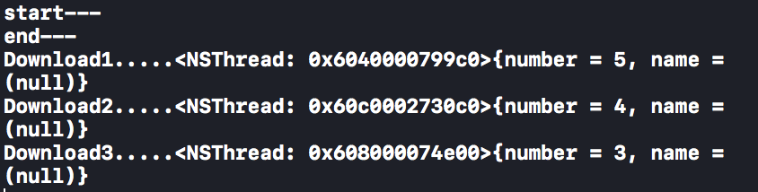
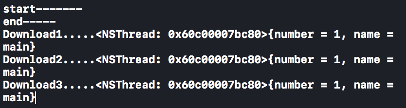
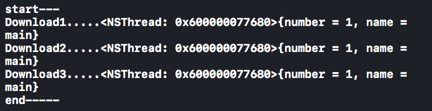
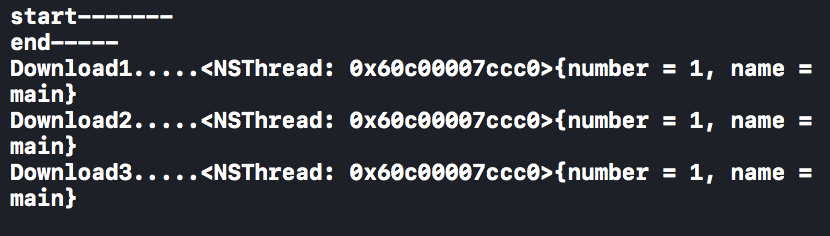
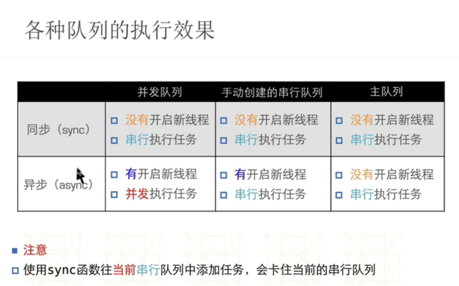
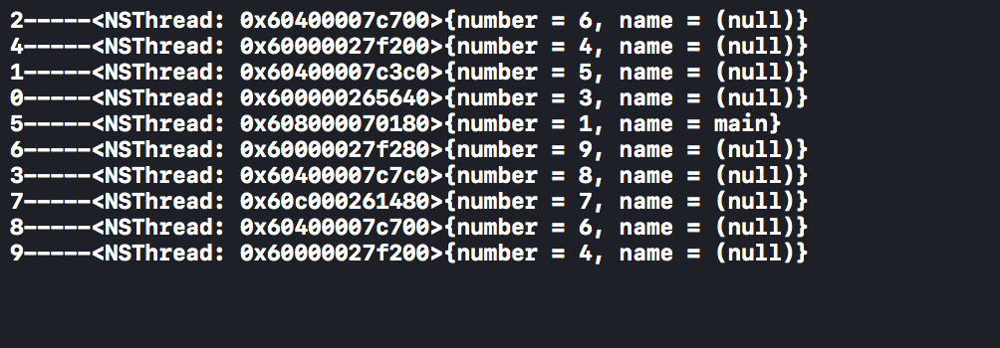
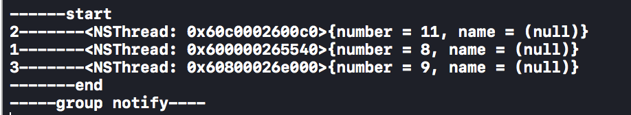

# MultiThread

## 1. Basic Thread

```swift
// 卖票例子
override func touchesBegan(_ touches: Set<UITouch>, with event: UIEvent?) {
    let threadA = Thread(target: self, selector: #selector(self.sellTicket), object: nil)
    let threadB = Thread(target: self, selector: #selector(self.sellTicket), object: nil)
    let threadC = Thread(target: self, selector: #selector(self.sellTicket), object: nil)

    threadA.name = "A"
    threadB.name = "B"
    threadC.name = "C"

    threadA.start()
    threadB.start()
    threadC.start()
}

@objc
private func sellTicket() {
    while true {
        objc_sync_enter(self)
        let count = self.totalCount
        if count > 0 {
            self.totalCount = count - 1;
            print("-----\(String(describing: Thread.current.name!))----left \(self.totalCount) tickets")
        } else {
            print("-----\(String(describing: Thread.current.name!))----all tickets were sold out")
//                break
            Thread.exit()
        }
        objc_sync_exit(self)
    }
}
```

Note:

*   We can create a thread using `let threadA = Thread(target: self, selector: #selector(self.sellTicket), object: nil)`, but remember we need call `threadA.start()` to start the thread running.

*   We can use `threadA.name = "A"` to set a thread name.

*   We can use `objc_sync_enter(self)` and `objc_sync_exit(self)` to do a lock part for the code.

*   We can also use `Thread.exit()` to exit a thread. But note, this is a class function.

*   We can use `self.performSelector(onMainThread: #selector(self.setTicketsCountLabel(object:)), with: self, waitUntilDone: true)` to go back to main thread. But note, looks like the `with:` parameter **can only pass Object**, directly **pass an int will not work**.

## 2. GCD basic combination

```swift
private func asyncConcurrent() {
    print("start---")
    DispatchQueue.global().async {
        print("Download1.....\(Thread.current)")
    }
    DispatchQueue.global().async {
        print("Download2.....\(Thread.current)")
    }
    DispatchQueue.global().async {
        print("Download3.....\(Thread.current)")
    }
    print("end---")
}
```

Result:



```swift
private func asyncSearial() {
    print("start-------")
    DispatchQueue.main.async {
        print("Download1.....\(Thread.current)")
    }
    DispatchQueue.main.async {
        print("Download2.....\(Thread.current)")
    }
    DispatchQueue.main.async {
        print("Download3.....\(Thread.current)")
    }
    print("end-----")
}
```

Result:



```swift
private func syncConcurrent() {
    print("start---")
    DispatchQueue.global().sync {
        print("Download1.....\(Thread.current)")
    }
    DispatchQueue.global().sync {
        print("Download2.....\(Thread.current)")
    }
    DispatchQueue.global().sync {
        print("Download3.....\(Thread.current)")
    }
    print("end-----")
}
```

Result:



```swift
private func syncSearial() {
    print("start")
    print(Thread.current)
    let searialQueue = DispatchQueue(label: "queuename")
    searialQueue.sync {
        print("Download1.....\(Thread.current)")
    }
    searialQueue.sync {
        print("Download2.....\(Thread.current)")
    }
    searialQueue.sync {
        print("Download3.....\(Thread.current)")
    }
    print("end-----")

    DispatchQueue.main.asyncAfter(deadline: .now()+1) {
        print("1s late to run")
    }
}
```

Result:



Note:

*   `async` has the ability to create a new thread. While `sync` doesn't have this ability.

*   `async` and `concurrency` will create some new thread and a concurrency queue to run task. So the task running may not according to its order.

*   `MainQueue` is a serial queue. And when you are using MainQueue, the async will **not** work. It will still go as sync.

*   `DispatchQueue.global()` is a default concurrent queue.

*   **Searial MainQueue called by sync will give a dead lock, so your app will be stuck**.

*   `async` and `serial` will go as the order. As the serial queue need to run task one by one. But note the original thread will still go. Check example above.

*   

*   We can use `DispatchQueue.main.asyncAfter` to do a delay running.

*   `Dispatch once` is no longer work in swift. Use `lazy` instead.

## 3. Barrier async

```swift
private func barrier() {
    print("start-------")
    let queue = DispatchQueue(label: "concurrentQ", attributes: .concurrent)
    queue.async {
        for i in 0..<100 {
            print("\(i)-------\(Thread.current)")
        }
    }
    queue.async {
        for i in 0..<100 {
            print("\(i)-------\(Thread.current)")
        }
    }
    queue.async(flags: .barrier) {
        print("+++++++++++++++++++++")
    }
    queue.async {
        for i in 0..<100 {
            print("\(i)-------\(Thread.current)")
        }
    }
    queue.async {
        for i in 0..<100 {
            print("\(i)-------\(Thread.current)")
        }
    }
    print("end--------")
}
```

Note:

*   Barrier is used to divide the async thread. In the example above, the top 2 thread will run first, then the bottom 2 thread will start running.

*   Barrier **cannot** work on `DispatchQueue.global()`, so we must create a concurrent queue.

## 4. Concurrent perform

```swift
private func concurrentPerform() {
    DispatchQueue.concurrentPerform(iterations: 10) { (i) in
        print("\(i)-----\(Thread.current)")
    }
}
```

Result:



Note:

*   This Concurrent perform is an async process, it will create different thread to run task. This will increase the performance.

## 5. Dispatch group

```swift
private func dispatchGroup() {
    print("------start")
    let group = DispatchGroup()
    DispatchQueue.global().async(group: group) {
        print("1-------\(Thread.current)")
    }
    DispatchQueue.global().async(group: group) {
        print("2-------\(Thread.current)")
    }
    DispatchQueue.global().async(group: group) {
        print("3-------\(Thread.current)")
    }
    group.notify(queue: DispatchQueue.global()) {
        print("-----group notify----")
    }
    group.wait()
    print("-------end")
}
```

Result:



Note:

*   In async dispatch group, it's still async.

*   We can use `group.notify` to trigger a task that need run after all the async task in the group.

*   We can use `group.wait()` to block the current thread.

## 6. Operation Queue

In swift, it doesn't support for `NSInvocationOperation`.

1.  Block Operation

    ```swift
    private func blockOperationDemo() {
        let op1 = BlockOperation {
            print("---download1-----\(Thread.current)")
        }
        let op2 = BlockOperation {
            print("---download2-----\(Thread.current)")
        }
        let op3 = BlockOperation {
            print("---download3-----\(Thread.current)")
        }

        let operationQueue = OperationQueue()
        operationQueue.addOperation(op1)
        operationQueue.addOperation(op2)
        operationQueue.addOperation(op3)
    }
    ```

    We need to create operation queue to start multi thread process. And when we add `BlockOperation` to operationQueue, we don't need to call operation.start to start the operation.

    If we want to use main thread, then please use `OperationQueue.main`.

2.  Custom Operation

    ```swift
    class MyOperation: Operation {
        override func main() {
            print("---download...-----\(Thread.current)")
        }
    }

    private func myOperationDemo() {
        let op1 = MyOperation()
        let op2 = MyOperation()
        let op3 = MyOperation()

        let operationQueue = OperationQueue()
        operationQueue.addOperation(op1)
        operationQueue.addOperation(op2)
        operationQueue.addOperation(op3)
    }
    ```

    When we create custom operation, we need rewrite the `main` function to write task.

3.  Operation dependency

    ```swift
    private func blockOperationDemo() {
        let op1 = BlockOperation {
            print("---download1-----\(Thread.current)")
        }
        let op2 = BlockOperation {
            print("---download2-----\(Thread.current)")
        }
        let op3 = BlockOperation {
            print("---download3-----\(Thread.current)")
        }
        op3.addDependency(op2)
        op3.addDependency(op1)

        let operationQueue = OperationQueue()
        operationQueue.addOperation(op1)
        operationQueue.addOperation(op2)
        operationQueue.addOperation(op3)
    }
    ```

    We can use `op3.addDependency(op2)` to change the task running order. In the example above, op3 will run after finishing op1 and op2.
