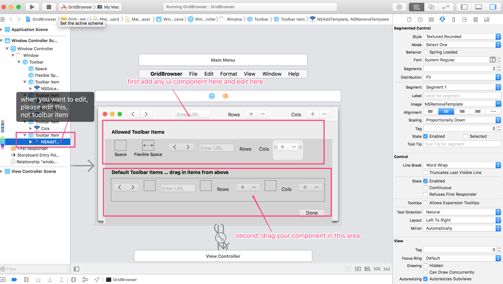

# NSToolbar

## 1. storyboard usage

Note:

-   Please first add compnent to "allowed toolbar items", then drag it to "default toolbar items".
-   When you edit your component, please make sure you are editing your component, not `toolbarItem`.
-   You can set to show `icon only`, `icon and Label` or `label only` in toolbar properties.
-   You can also `hide window title` to made your toolbar shows the same row with the close, minimize, maximize icon like above picture. Be sure check `Hide Title` in window.
-   When you define the toolbar IBAction, please first define the IBAction in your toolbar nested ViewController. Then Control Drag your toolbar icon to the ViewController as `First responder`. The event chain will pass your toolbar action to View controller. 