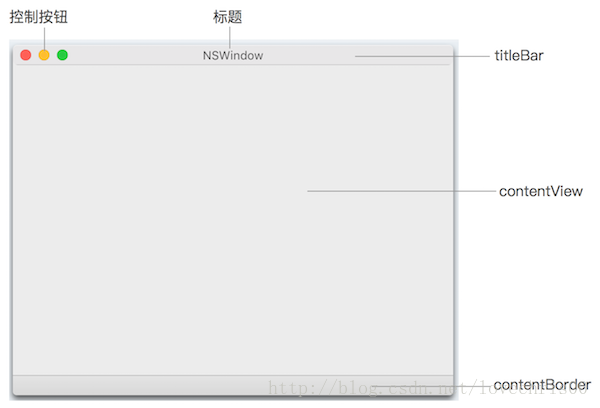

# NSWindowController

## 1. NSWindow graph



## 2. add NSWindowController by code

[Check this page](https://mikulove.com/2017/06/30/macos-xue-xi-bi-ji-shi-yong-chun-dai-ma-gou-jian-mac-ying-yong/)

1. create window controller fist:

    ```swift
    import Cocoa

    class MainWindowController: NSWindowController {
        
        lazy var mainWindow: NSWindow? = {
            let window = NSWindow(contentViewController:SplitViewController()) // initial window with controller
            window.title = "stormViewer"
            return window
        }()
        
        override init(window: NSWindow?) {
            super.init(window: window)
            self.window = mainWindow
            self.window?.center()
        }
        
        required init?(coder: NSCoder) {
            fatalError("init(coder:) has not been implemented")
        }
    }
    ```

    Note:
    -   You must set window in `init`, other part like `loadWindow()` won't work
    -   Add `contentViewController` when you create NSWindow, then you can set up your contentViewController view size to define the window size.

2. add to AppDelegate

    ```swift
    import Cocoa

    @NSApplicationMain
    class AppDelegate: NSObject, NSApplicationDelegate {

        lazy var mainWindowController = {
            return MainWindowController()
        }()

        func applicationDidFinishLaunching(_ aNotification: Notification) {
            // Insert code here to initialize your application
            self.mainWindowController.showWindow(self)
        }
    }
    ```