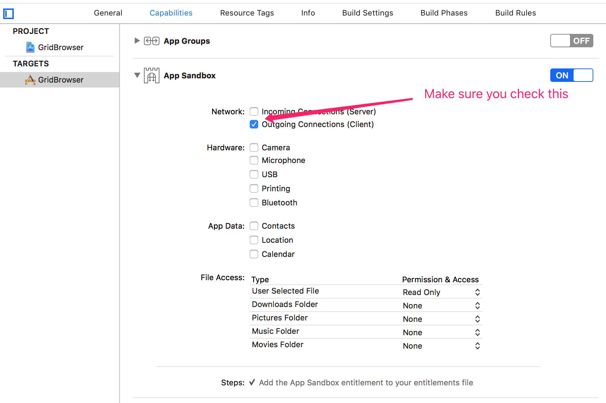

# URLSession

## 0. trick

1.  Please use `dataTask.resume()` to start the network call.
2.  All the URLSession task is not in main thread
3.  When you use network, you need to setup `App Sandbox` network part.
    
4. When you download something, you need **close** `App Sandbox` in `project.entitlements` file.
5.  Remember to **invalid URLSession**

## 1. simple data get

```swift
private func get() {
    let session = URLSession.shared
    
    guard let url = URL(string: "https://jsonplaceholder.typicode.com/posts") else { return }
    let dataTask = session.dataTask(with: url) { (data: Data?, response: URLResponse?, err: Error?) in
        if err == nil {
            let res = try! JSONSerialization.jsonObject(with: data!, options: JSONSerialization.ReadingOptions.allowFragments) as! [[String: Any]]
            print("\(res[0]["title"]! as! String)")
        }
    }
    dataTask.resume()
}

deinit {
    URLSession.shared.finishTasksAndInvalidate()
}
```

Note:

-   You must use `dataTask.resume()` to start the network call.
-   please check error in your callback
-   Use `session.dataTask(with: url) { (data: Data?, response: URLResponse?, err: Error?) in {}` to create a get task
-   Remember to **invalid URLSession**

## 2. simple data post

```swift
private func post() {
    let session = URLSession.shared
    
    guard let url = URL(string: "https://jsonplaceholder.typicode.com/posts") else { return }
    var urlRequest = URLRequest(url: url)
    urlRequest.httpMethod = "POST"
    urlRequest.allHTTPHeaderFields = ["Content-Type": "application/json"]

    let post = Post(user_id: 12, id: nil, title: "haha", body:"I'm body")
    urlRequest.httpBody = try? JSONEncoder().encode(post)

    let dataTask = session.dataTask(with: urlRequest) { (data: Data?, response: URLResponse?, error: Error?) in
        let post = try? JSONDecoder().decode(Post.self, from: data!)
        print(post!)
    }
    
    dataTask.resume()
}

deinit {
    URLSession.shared.finishTasksAndInvalidate()
}
```

Note:

-   For a `post` request, you must use `URLRequest` and set up `httpMethod`, `allHTTPHeaderFields` and `httpBody` for the request
-   Remember the `dataTask.resume()` to start network call
-   Remember to **invalid URLSession**

## 3. Using delegate to get simple data (if you need progress)

```swift
private func sessionDelegate() {
    let session = URLSession(configuration: URLSessionConfiguration.default, delegate: self, delegateQueue: OperationQueue.main)
    guard let url = URL(string: "https://jsonplaceholder.typicode.com/posts/5") else { return }
    let dataTask = session.dataTask(with: url)
    dataTask.resume()
}

// receive initial response header, response is header
func urlSession(_ session: URLSession, dataTask: URLSessionDataTask, didReceive response: URLResponse, completionHandler: @escaping (URLSession.ResponseDisposition) -> Void) {
    print(#function)
    completionHandler(.allow)
}

func urlSession(_ session: URLSession, dataTask: URLSessionDataTask, didReceive data: Data) {
    print(#function)
    self.fileData.append(data)
}

func urlSession(_ session: URLSession, task: URLSessionTask, didCompleteWithError error: Error?) {
    print(#function)
    print(String(data: self.fileData, encoding: String.Encoding.utf8)!)
}

deinit {
    self.session?.finishTasksAndInvalidate()
}
```

Note:

-   in first initial response delegate method, you need pass `completionHandler(.allow)` to allow the data transfer continue
-   You need implement `URLSessionDataDelegate`
-   Remember to **invalid URLSession**

## 4. simple download

```swift
private func download() {
    let session = URLSession.shared
    let url = URL(string: "https://d3cbihxaqsuq0s.cloudfront.net/images/53402047_xl.jpg")!
    let downloadTask = session.downloadTask(with: url) { (fileUrl: URL?, response: URLResponse?, error: Error?) in
        print("\(fileUrl!)-----")

        let downloadDir = FileManager.default.urls(for: .downloadsDirectory, in: .userDomainMask)[0]

        let storeUrl = downloadDir.appendingPathComponent((response?.suggestedFilename)!)
        do {
            try FileManager.default.moveItem(at: fileUrl!, to: storeUrl)
        }
        catch {
            print("move error")
        }

        print(storeUrl)
    }
    downloadTask.resume()
}

deinit {
    URLSession.shared.finishTasksAndInvalidate()
}
```

Note:

-   You need to use `session.downloadTask` to download.
-   The downloaded file will initially stored in tmp folder, so you need to use `FileManager.default` to move the tmp file to where you want to store.
-   Remember `downloadTask.resume()` to start.
-   `response?.suggestedFilename` will give you the downloaded file original name.
-   Remember to **invalid URLSession**

## 5. download with delegate

```swift
private func delegateDownload() {
    let session = URLSession(configuration: URLSessionConfiguration.default, delegate: self, delegateQueue: OperationQueue.main)
    let url = URL(string: "https://d3cbihxaqsuq0s.cloudfront.net/images/53402047_xl.jpg")!
    let dataTask = session.downloadTask(with: url)
    dataTask.resume()
}

func urlSession(_ session: URLSession, downloadTask: URLSessionDownloadTask, didWriteData bytesWritten: Int64, totalBytesWritten: Int64, totalBytesExpectedToWrite: Int64) {
    print("\(CGFloat(totalBytesWritten)/CGFloat(totalBytesExpectedToWrite))")
}

func urlSession(_ session: URLSession, downloadTask: URLSessionDownloadTask, didResumeAtOffset fileOffset: Int64, expectedTotalBytes: Int64) {
    print(#function)
}

func urlSession(_ session: URLSession, downloadTask: URLSessionDownloadTask, didFinishDownloadingTo location: URL) {
    print(#function)
    
    print("\(location)-----")
    
    let downloadDir = FileManager.default.urls(for: .downloadsDirectory, in: .userDomainMask)[0]
    let storeUrl = downloadDir.appendingPathComponent((downloadTask.response?.suggestedFilename)!)
    
    do {
        try FileManager.default.moveItem(at: location, to: storeUrl)
    }
    catch {
        print("move error")
    }
    
    print(storeUrl)
}

func urlSession(_ session: URLSession, task: URLSessionTask, didCompleteWithError error: Error?) {
    print(#function)
}

deinit {
    self.session?.finishTasksAndInvalidate()
}
```

Note:

-   use `session.downloadTask`
-   implements `URLSessionDownloadDelegate`
-   Remember to **invalid URLSession**