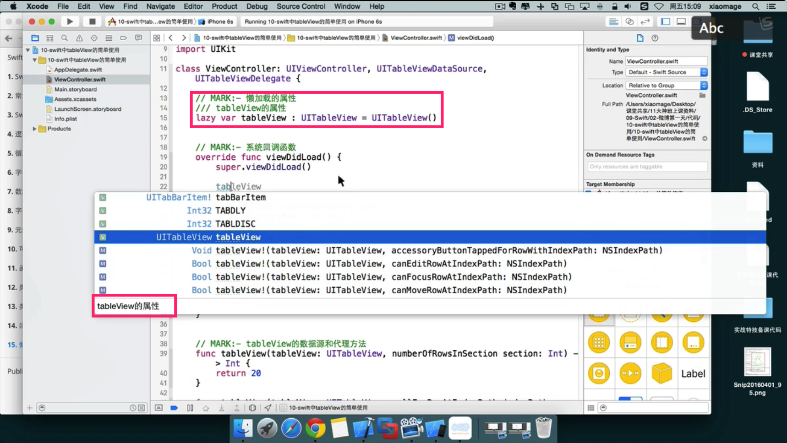
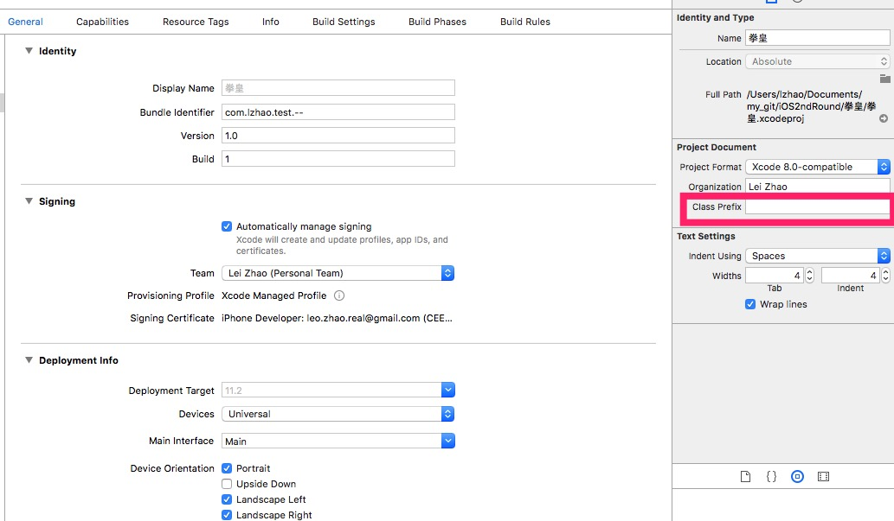

# xcode for swift tips

## 1. Use `MARK:-` to mark the function that you want to quickly track. It's like `#pragma mark-` in objective-c

## 2. Use `///` to mark a variable or constant, then each time when you try to use that variable, you can get a hint

## 3. Setup file prefix

## 4. Set up Http Security

We can add `App Transport Security Settings` to info.plist. Then we need to add `Allow Arbitrary Loads` to it to open the Http security.
